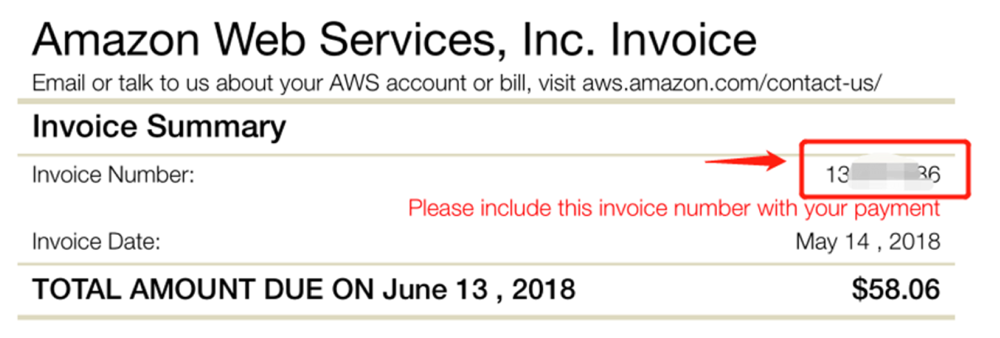
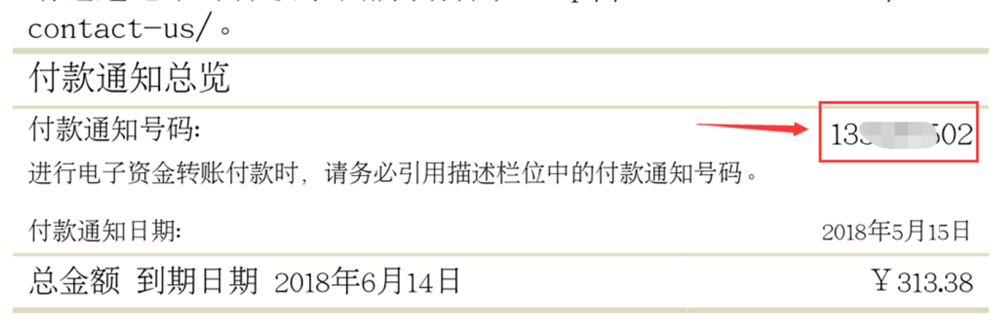
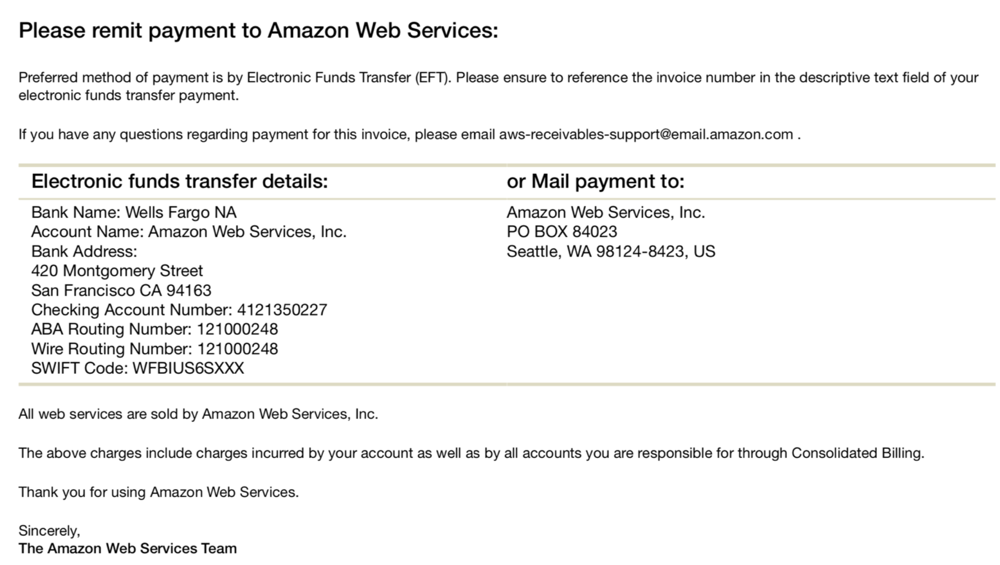
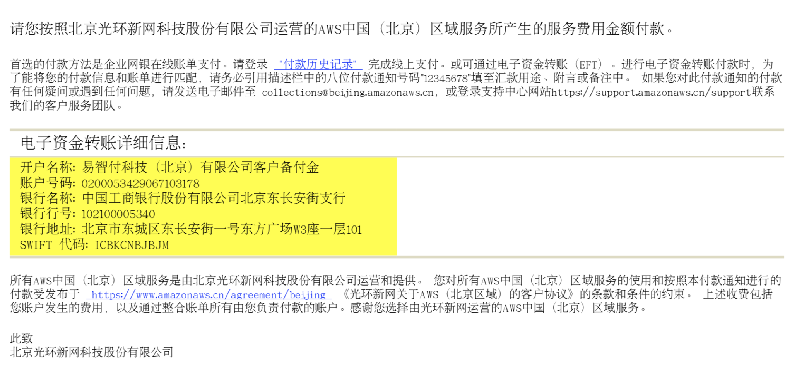

# 账单管理 

### AWS账单属于后付费

收费方式：两种，信用卡和电汇（暂时只用过两种）

账单生成：

每个月的账单会在下个月的3-4号生成账单，并发送到你注册账号的邮箱中，账单生成后，30天内完成付款

例如：

你1月份的账单会在2月3-4号生成，最晚在3月底缴清即可（具体看账单控制台可以看到）

### 支付方式：

**信用卡支付：**

**银联卡**、外币卡

小额费用可以直接使用信用卡支付。

国内个人信用卡限额，超过5万美金的话，不能再使用信用卡支付

**电汇支付：**

电汇只能在使用信用卡支付后，第二个月申请变更为电汇支付，

新开账号的时候直接向AWS申请直接为电汇方式

<table>
    <tr>
        <td >

        
国外账单

        
</td>
        <td >

        
国内账单

        
</td>
    </tr>

注意！

在电汇的时候，要在备注信息填上账单ID，这个方便aws对账，我们在收到电汇回执单后，需要跟AWS发邮件进行对账。因为AWS每天会收到很多账单汇款，无法区分都是谁汇款过来的。

（要不你打电汇过去，也不知道你谁付款的，电汇完毕成功后也要留个电汇的回执单，已证明电汇成功）

国外账号，电汇到AWS亚洲区域银行的一个账号，这个在账单上面可以看到

国外汇款后，拿到回执单了需要提个case进行抵账确认aws已收到汇款

国内账号，一个是汇款到光环新网，一个是西云数据

<table>
    <tr>
        <td >

        
国外账单

        
</td>
        <td >

        
国内账单

        
</td>
    </tr>

### 关于发票问题：

**全球账号：**

国外账号是没有发票的，只有收据。就是每个月3-4号发送到你邮箱的那个账单。

账单上面会显示你的消费明细，和需要汇款的地址（银行账户相关信息）

**中国账号：**

中国账号都是对公账号进行汇款

发票抬头为你注册账号时使用的公司名称，公司名称为什么，发票抬头就是什么

[申请发票流程说明](http://cet-bucket.s3.cn-north-1.amazonaws.com.cn/Process/20171009如何申请增值税发票 How to Apply for Fapiao.pdf)